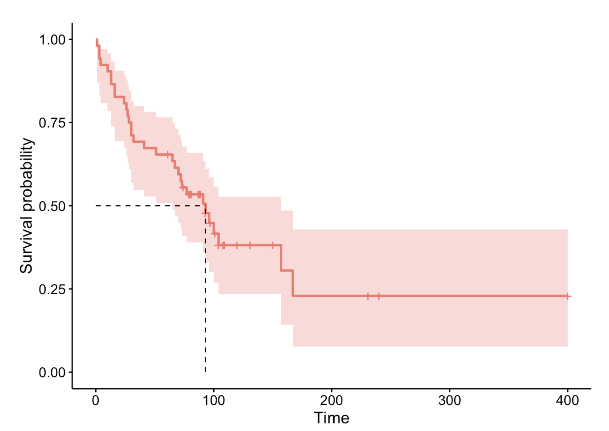

## Kaplan-Meier survival curve
### Concept
* _What is it_: a graphical representation of the **Kaplan-Meier estimator**’s output
* _What it does_: plot the estimated survival probabilities (from the estimator) against time
* _Why we need it_: show how the probability of survival decreases as events occur, with steps at each event time

### Graphs

* X-axis (Time): Duration of time after a starting point (e.g. diagnosis, treatment)
* Y-axis (Survival probability): Probability of surviving beyond a specific time.
* Stepwise curve: Each drop represents an event (e.g. death, failure)
* Censoring marks (usually +): Individuals for whom the event hasn't happened yet (e.g. lost to follow-up)
* Confidence interval shading: Indicates uncertainty in the estimate (commonly 95%)
* Dashed black lines: Median survival time. It is the time point where survival probability drops to 0.5 (50%)

## Interpretation
* At any point on the curve, the vertical value gives the estimated probability that a subject survives past that time.
* A steeper drop means a higher rate of events happening in that period.
